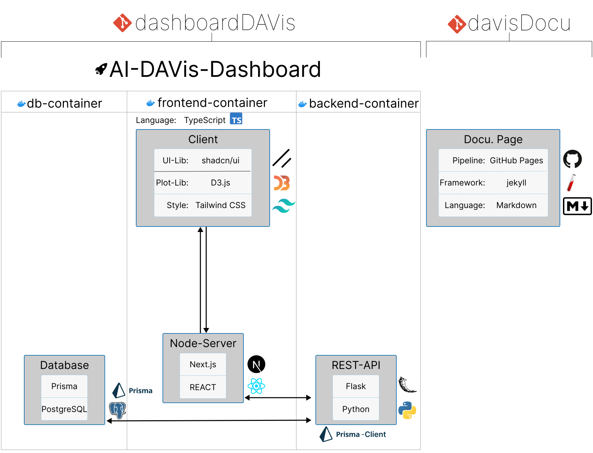

# DAVis Dev Documentation

{:.new}
This site contains the development related documentation of the DAVis project.

{:.note}
Link: [How to use/add things to the documentaion page?](how_to_use)

<!--[tech-stack]: assets/DAVisTechnologyStack.svg
![Technology Stack][tech-stack]-->

{:.border}
*technology stack of the DAVis-Dashboard*
